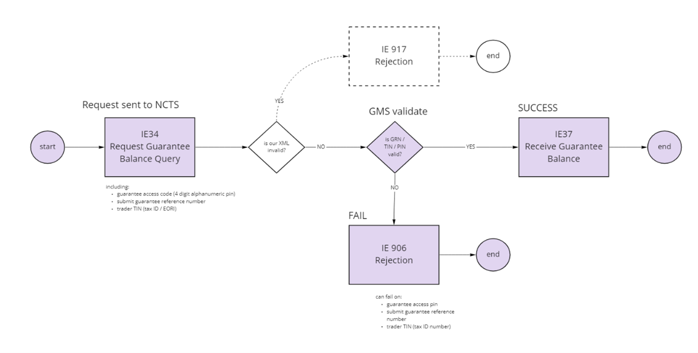

# CTC Guarantee Balance API Service Guide

## Useful CTC page links

[CTC Guarantee Balance Testing Guide](guides/ctc-guarantee-balance-testing-guide/)

[CTC Guarantee Balance API documentation](api-documentation/docs/api/service/common-transit-convention-guarantee-balance/1.0)

[CTC Traders API documentation](api-documentation/docs/api/service/common-transit-convention-traders/1.0)

## Introduction

If you move goods between the UK and other countries who are part of the Common Transit Convention (CTC), your movements must have the appropriate guarantee funds to cover eventualities, such as: the loss of goods during transit.

Your goods can be delayed if your Guarantee Balance does not contain enough funds. This API has been provided so that you can check your balance and plan accordingly or increase it if you need to.

## Before you start

You must understand:

- the CTC Guarantee Balance API provides a snapshot of the guarantee state at the time the request is submitted

- it is possible that even a very short delay could coincide with events that could change your balance information, such as the release of goods at the office of destination replenishing the guarantee amount locked against that movement

- the balance responses could become out of date quickly if you have a lot of transit movements progressing at the same time

## Authorisation

The endpoints in this API are user restricted. Further details about the User Restricted Authentication are given on the [Developer Hub Authorisation](api-documentation/docs/authorisation) page 4.

## Process flow

The process of getting a Guarantee Balance is explained in this process flow chart:

### Overview of Guarantee Balance process

## How to use

In order to use the service, you must be signed in with your [Government Gateway](https://www.access.service.gov.uk/login/signin/creds) credentials.

To find out how much is left on a Guarantee Balance, you must provide:

- the principal Economic Operators Registration and Identification (EORI) number for the guarantee

- Access Code (a 4 digit alphanumeric pin that is not case sensitive)

- Guarantee Reference Number (GRN)

You should note that Guarantee Balance information is only available for:

-  type 0: guarantee waiver
-  type 1: comprehensive guarantee
-  type 9: individual guarantee with multiple usage

Guarantee Balance information is not supported for:

-  type 2: individual guarantee (by guarantor)
-  type 4: individual guarantee in the form of vouchers

See the GOV.UK guidance for more [detailed information about NCTS guarantees](https://www.gov.uk/government/publications/the-new-computerised-transit-system-supporting-guidance/ncts-guarantees).

## Endpoints

[POST endpoint](https://developer.tax.service.gov.uk/api-documentation/docs/api/service/common-transit-convention-guarantee-balance/1.0#Send%20a%20Balance%20Request) - used to initiate the balance request. You may receive a response immediately with a 200 OK or 400 Bad Request response, or a 202 Accepted response with a balance request ID.

[GET endpoint](https://developer.tax.service.gov.uk/api-documentation/docs/api/service/common-transit-convention-guarantee-balance/1.0#Check%20the%20status%20of%20a%20Balance%20Request) - used to check the status of a balance request for which a response could not be provided immediately. You can use the balance request ID returned by the 202 Accepted response to call this endpoint.

## Error codes

The following error codes are limited in their detail due to constraints of the NCTS system.

<table>
  <colgroup span="4"></colgroup>
  <tr>
    <th>errorType</th>
    <th>errorPointer</th>
    <th>errorReason</th>
    <th>errorMessage</th>
  </tr>
  <tr>
    <td>12</td>
    <td>RC1.TIN</td>
    <td></td>
    <td>Incorrect EORI Number</td>
  </tr>
  <tr>
    <td>12</td>
    <td>GRR(1).Guarantee reference number (GRN)</td>
    <td></td>
    <td>Incorrect Guarantee Reference Number</td>
  </tr>
  <tr>
    <td>12</td>
    <td>GRR(1).ACC(1).Access code</td>
    <td></td>
    <td>Incorrect Access Code</td>
  </tr>
  <tr>
    <td>14</td>
    <td>GRR(1).GQY(1).Query identifier</td>
    <td>R261</td>
    <td>Unsupported Guarantee Type</td>
  </tr>
  <tr>
    <td>12</td>
    <td>GRR(1).OTG(1).TIN</td>
    <td></td>
    <td>EORI and Guarantee Reference Number do not match</td>
  </tr>
  <tr>
    <td>26</td>
    <td>RC1.TIN</td>
    <td></td>
    <td>Query limit for the EORI has been exceeded, or an unknown EORI has been used.</td>
  </tr>
</table>

**Note:** There is a limit on the number of queries that can be made against an EORI number over a 24 hour period. An errorType 26 is returned if this limit is exceeded. The limit is currently set to 1000 in both Trader Test and Production environments; however, the Production limit may be subject to revision based upon usage.

## API rate limit

The current API rate limit is 1 request per minute per guarantee reference. This improves the service provided to your software. You cannot request an increase to this rate limit.

## Timing out period

Requests that take more than an hour to process will expire and will not be visible by the query endpoints. If this happens, you should start a new balance request. During normal service the response should take only seconds but if you are waiting longer then you should check the [NCTS service availability](https://www.gov.uk/government/publications/new-computerised-transit-system-service-availability-and-issues/new-computerised-transit-system-service-availability-and-issues).

## JSON schema files and cURL commands

Detailed information for JSON schema files and cURL commands are available in the [Guarantee Balance Testing Guide](guides/ctc-guarantee-balance-testing-guide/).

## Get support

Before you get in touch, find out if there are any planned API downtime or technical issues by checking:

- [HMRC API platform availability](https://api-platform-status.production.tax.service.gov.uk/?_ga=2.107563906.1463571304.1643109365-1592354348.1635936762)

- [NCTS service availability](https://www.gov.uk/government/publications/new-computerised-transit-system-service-availability-and-issues/new-computerised-transit-system-service-availability-and-issues)

If you have specific questions about the CTC Guarantee Balance API, get in touch with our Software Developer Support Team.

You&#39;ll get an initial response in 2 working days.

Email us your questions to SDSTeam@hmrc.gov.uk. We might ask for more detailed information when we respond.